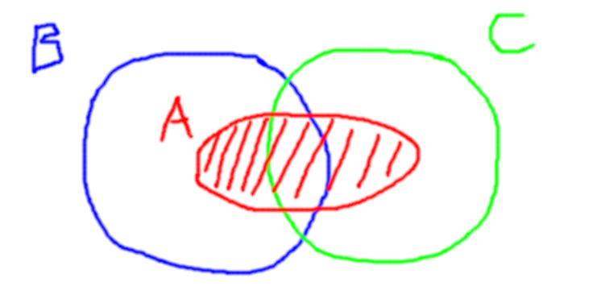

> 对于所有集合 $A,B,C,D$ 判定下面的哪些论断为真. 如果相互蕴含关系不成立，判定有哪一种蕴含关系. 如果等号不成立，判定用包含关系 $\subset$ 或 $\supset$ 代替等号时，相应的表述是否成立？

## 理念

本文中采用尽可能笨拙但通用的证明方法证明集合之间的相等以及包含关系，我们会不加证明地使用尽可能少的逻辑运算中的事实，对集合问题加以证明。另外，为了让读者能够清晰的感受到各个小问题中集合运算的结果究竟是何物，本文不仅证明了题目中所要求的 “蕴含方向”，还尽可能地计算出了化简后的实际的逻辑表达式以及集合表达式。

## 第一组：1～4

前四个表达式内容如下（题目使然，不一定是真命题）。

> 1. $A\subset B$ 且 $A\subset C$ $\Longleftrightarrow$ $A \subset (B\cup C)$.
> 2. $A\subset B$ 或 $A\subset C$ $\Longleftrightarrow$ $A\subset (B\cup C)$.
> 3. $A\subset B$ 且 $A\subset C$ $\Longleftrightarrow$ $A\subset (B\cap C)$.
> 4. $A\subset B$ 或 $A\subset C$ $\Longleftrightarrow$ $A\subset (B \cap C)$.

在证明这一组命题相关的问题时，我们首先不加证明地给出以下的事实：

> 1. 根据集合包含的定义：$A\subset B$ $\Leftrightarrow$ $\forall x(x\in A \Rightarrow x\in B)$.
> 2. 根据逻辑运算的性质：$(P\Rightarrow Q)=(\neg P) \or Q$.
> 3. 根据全称量词的性质：$(\forall x(f(x)) \and \forall x(g(x)))=\forall x(f(x)\and g(x))$.

### 考察 $A\subset B$ 且 $A\subset C$

根据集合的包含的定义：

> $A\subset B$ $\Leftrightarrow$ $\forall x(x\in A \Rightarrow x\in B)$.
>
> $A\subset C$ $\Leftrightarrow$ $\forall x(x\in A \Rightarrow x\in C)$.

根据逻辑运算的性质可知：

> $(x\in A \Rightarrow x\in B)$ $\Leftrightarrow$ $(x\notin A \or x\in B)$.
>
> $(x\in A \Rightarrow x\in C)$ $\Leftrightarrow$ $(x\notin A \or x\in C)$. 

于是:

> $(A\subset B)\and (A \subset C)=(\forall x(x\notin A \or x\in B)) \and (\forall x(x\notin A \or x\in C))$.

再根据全称量词的性质可知：

> $(\forall x(x\notin A \or x\in B)) \and (\forall x(x\notin A \or x\in C))=\forall x((x\notin A \or x\in B)\and(x\notin A \or x\in C))$
>
> $=\forall x((x\notin A)\or(x\in B \and x\in C))$  （根据逻辑运算的分配率）.
>
> $=\forall x((x\in A) \Rightarrow (x\in B\and x\in C))$ （根据逻辑运算的性质）.
>
> $=\forall x((x\in A)\Rightarrow (x\in (B\cap C)))$ （根据集合交集的定义）.
>
> $=(A\subset(B\cap C))$ （根据集合包含的定义）.

综上所述：

> $(A\subset B)\and (A \subset C)=(A\subset(B\cap C))$.

换言之，原命题中的第三个命题成立.

### 考察一个关于 $A\subset (B\cup C)$ 反例

假设 $A\subset (B\cup C)$ 成立，我们能够找到一个反例使 $A\subset B$ 与 $A\subset C$ 均不成立.

### 结论

略去了一些证明过程，我们可以给出正确的蕴含方向：

> 1. $A\subset B$ 且 $A\subset C$ $\Rightarrow$ $A \subset (B\cup C)$.
> 2. $A\subset B$ 或 $A\subset C$ $\Rightarrow$ $A\subset (B\cup C)$.
> 3. $A\subset B$ 且 $A\subset C$ $\Leftrightarrow$ $A\subset (B\cap C)$.
> 4. $A\subset B$ 或 $A\subset C$ $\Leftarrow$ $A\subset (B \cap C)$.

## 第二组：5~6

第二组表达式内容如下（题目使然，不一定是真命题）：

> 5. $A-(A-B)=B$.
>
> 6. $A-(B-A)=A-B$.

### 证明 $A-(A-B)=A\cap B$

根据集合差集的定义：

> $x\in(A-(A-B))$ $\Leftrightarrow$ $(x\in A) \and (x \notin (A-B))$.
>
> $x\in (A-B)$ $\Leftrightarrow$ $(x\in A) \and (x\notin B)$.

根据逻辑运算的 DeMorgan 定律：

> $x\notin (A-B)$ $\Leftrightarrow$ $(x\notin A) \or (x \in B)$.

于是可以进行带入，得到：

> $x\in(A-(A-B))$ $\Leftrightarrow$ $(x\in A) \and ((x\notin A) \or (x \in B))$.

再对右侧用分配率：

> $x\in(A-(A-B))$ $\Leftrightarrow$ $((x\in A)\and (x\notin A)) \or ((x\in A)\and (x\in B))$.

由于 $(x\in A)\and (x\notin A)$ 是永假式，所以有：

> $x\in(A-(A-B))$ $\Leftrightarrow$ $((x\in A)\and(x\in B))$.

根据集合交集的定义可以得到：

> $x\in(A-(A-B))$ $\Leftrightarrow$ $(x\in (A\cap B))$.

由于此处 $x$ 可以取遍任意元素，因此得到 $(A-(A-B))=(A\cap B)$.

### 证明 $A-(B-A)=A$

任取 $x\in(A-(B-A))$，根据集合差集的定义可知：

> $x\in(A-(B-A))$ $\Leftrightarrow$ $((x\in A) \and (x\notin (B-A)))$.
>
> $x\in(B-A)$ $\Leftrightarrow$ $(x\in B) \and (x \notin A)$.
>
> 于是根据逻辑运算的 DeMorgan 定律，得到 $x\notin(B - A)$ $\Leftrightarrow$ $((x\notin B) \or (x\in A))$.

于是可以对上式进行带入：

> $x\in(A-(B-A))$ $\Leftrightarrow$ $(x\in A)\and ((x\notin B) \or (x\in A))$.

对右侧用逻辑运算的分配率：

> $x\in(A-(B-A))$ $\Leftrightarrow$ $((x\in A)\and(x\in A)) \or ((x\in A) \and (x \notin B))$. 对右侧继续进行恒等逻辑变形.
>
> $x\in(A-(B-A))$ $\Leftrightarrow$ $((x\in A)\and\;\text{TRUE}) \or ((x\in A) \and (x \notin B))$. 用分配率提出 $(x\in A)$ 因子.
>
> $x\in(A-(B-A))$ $\Leftrightarrow$ $(x\in A)\and (\text{TRUE} \or (x \notin B))$.

由于 $(\text{TRUE} \or (x \notin B))$ 是重言式，因此得到：

> $x\in(A-(B-A))$ $\Leftrightarrow$ $(x\in A)$

由于该表达式对于任意的 $x$ 均成立，因此 $A-(B-A)=A$ 得证.

### 结论

不难证明 $(A\cap B)\subset B$ 以及 $A\supset (A-B)$，因此得到：

> 5. $A-(A-B)=(A\cap B)\subset B$.
> 6. $A-(B-A)=A\supset (A-B)$.

## 第三组：7～9

> 7. $A\cap (B-C)=(A\cap B)-(A\cap C)$.
> 8. $A\cup(B-C)=(A\cup B) - (A\cup C)$.
> 9. $(A\cap B)\cup(A-B)=A$.

### 证明 $A\cap (B-C)=(A\cap B)-(A\cap C)$

任取 $x\in((A\cap B)-(A\cap C))$，根据集合差集的定义可知：

> $x\in((A\cap B)-(A\cap C))$ $\Leftrightarrow$ $x\in(A\cap B)$ 且 $x\notin (A\cap C)$.
>
> 另外，根据交集的定义有 $x\in(A\cap C)$ $\Leftrightarrow$ $((x\in A) \and (x\in C))$.
>
> 根据逻辑运算的 DeMorgan 可以得到 $x\notin (A\cap C)$ $\Leftrightarrow$ $((x\notin A)\or(x\notin C))$.

于是将第三行带入第一行可以得到：

> $x\in((A\cap B)-(A\cap C))$ $\Leftrightarrow$ $(x\in(A\cap B))\and((x\notin A)\or(x\notin C))$. 带入交集的定义可以得到：
>
> $x\in((A\cap B)-(A\cap C))$ $\Leftrightarrow$ $(x\in B) \and ((x\in A)\and((x\notin A)\or(x\notin C)))$.

观察 $((x\in A)\and((x\notin A)\or(x\notin C)))$，并使用分配率，得到：

> $((x\in A)\and((x\notin A)\or(x\notin C)))$ $\Leftrightarrow$ $((x\in A)\and (x\notin A))\or((x\in A) \and (x\notin C))$.
>
> 由于 $(x\in A)\and (x\notin A)$ 为永假式，所以得到：
>
> $((x\in A)\and((x\notin A)\or(x\notin C)))$ $\Leftrightarrow$ $((x\in A) \and (x\notin C))$.

于是得到：

> $x\in((A\cap B)-(A\cap C))$ $\Leftrightarrow$ $(x\in B) \and (x\in A)\and(x\notin C)$.
>
> 由交换律做等价逻辑变形，得到 $x\in((A\cap B) - (A\cap C))$ $\Leftrightarrow$ $(x\in A) \and ((x\in B)\and(x\notin C))$. **(*)**
>
> 由差集的定义得到 $x\in((A\cap B) - (A\cap C))$ $\Leftrightarrow$ $(x\in A) \and (x\in(B-C))$.
>
> 由交集的定义得到 $x\in((A\cap B)-(A\cap C))$ $\Leftrightarrow$ $x\in(A\cap(B-C))$.

由于 $x$ 可以取遍任意可能值，因此可以证明 $((A\cap B)-(A\cap C))=A\cap(B-C)$. 另外，由上述 **(*)** 式可知，表达式 $A\cap(B-C)$ 中 $A$ 与 $B$ 在地位上对称，这一点比较反直觉. 

### 证明 $A\cup(B-C)=(A\cup B)-(C-A)$

任取 $x\in (A\cup (B-C))$，根据集合并集的定义可以得到：

> $x\in (A\cup (B-C))$ $\Leftrightarrow$ $(x\in A)\or (x\in (B-C))$.
>
> 根据集合差集的定义可知：$x\in(B-C) \Leftrightarrow ((x\in B)\and(x\notin C))$.
>
> 带入，得到：$x\in (A\cup (B-C))$ $\Leftrightarrow$ $(x\in A)\or ((x\in B)\and(x\notin C))$.

对右侧使用逻辑运算的分配率：

> $x\in (A\cup (B-C))$ $\Leftrightarrow$ $((x\in A)\or (x\in B))\and((x\in A)\or(x\notin C))$. 应用集合并集的定义.
>
> $x\in (A\cup (B-C))$ $\Leftrightarrow$ $(x\in (A\cup B))\and((x\in A)\or(x\notin C))$. 考虑对子表达式 $(x\in A)\or(x\notin C)$ 做两次取反，使用 DeMorgan 定律.
>
> $(x\in A)\or(x\notin C) \Leftrightarrow \neg((x\notin A) \and (x \in C)) \Leftrightarrow x\notin(C-A)$.

于是带入得到：

> $x\in (A\cup (B-C))$ $\Leftrightarrow$ $(x\in (A\cup B))\and(x\notin (C-A))$. 根据差集的定义得到：
>
> $x\in(A\cup(B-C)) \Leftrightarrow (x\in((A\cup B) - (C - A)))$.

### 证明 $(A\cap B)\cup(A-B)=A$

任取 $x\in((A\cap B)\cup(A-B))$，根据集合并集的定义可以得到：

> $x\in((A\cap B)\cup(A-B))$ $\Leftrightarrow$ $(x\in(A\cap B)) \or (x\in(A-B))$. 根据集合交集的定义以及集合差集的定义继续变形：
>
> $x\in((A\cap B)\cup(A-B)) \Leftrightarrow ((x\in A) \and (x\in B)) \or ((x\in A) \and (x\notin B))$. 使用分配率提出 $x\in A$ 得到：
>
> $x\in((A\cap B)\cup(A-B)) \Leftrightarrow (x\in A) \and((x\in B)\or (x\notin B))$.

由于 $(x\in B) \or (x \notin B)$ 为重言式，所以可以得到：

> $x\in((A\cap B)\cup(A-B)) \Leftrightarrow (x\in A)$.

由于 $x$ 可以取遍所有可能值，因此得到 $((A\cap B)\cup(A-B))=A$.

### 结论

> 7. $A\cap (B-C)=(A\cap B)-(A\cap C)$.
> 8. $A\cup(B-C)=((A\cup B)-(C-A))\supset (B-A-C) = ((A\cup B)-(A\cup C))$.
> 9. $(A\cap B)\cup(A-B)=A$

## 第四组：10~12

注：答案作者认为，这一组是本题中难度最大的一组小问：

> 10. $A\subset C$ 且 $B\subset D$ $\Longrightarrow$ $(A\times B)\subset (C\times D)$.
> 11. (10) 的逆.
> 12. (10) 的逆，假定 $A$ 和 $B$ 为非空集合.

### 证明 $(A\times B)\subset (C\times D) \Leftrightarrow (A=\varnothing) \or (B=\varnothing) \or ((A\subset C) \and (B\subset D))$

在证明这一命题前，我们需要假定读者已经了解如下逻辑命题为真：

> $\forall a \forall b (P(a, b)\and Q(a, b)) = (\forall a \forall b P(a, b)) \and (\forall a \forall b Q(a, b))$

根据笛卡尔积的定义，有：

> $(A\times B)\subset (C\times D) \Leftrightarrow \forall a \forall b (((a\in A)\and(b\in B)) \Rightarrow ((a, b)\in C\times D))$. 继续考虑笛卡尔积的定义：
>
> $(A\times B)\subset (C\times D) \Leftrightarrow \forall a \forall b (((a\in A)\and(b\in B)) \Rightarrow ((a\in C) \and (b \in D)))$.

由逻辑恒等式 $(P\Rightarrow Q) \Leftrightarrow (\neg P \or Q)$，得到：

> $(A\times B)\subset (C\times D) \Leftrightarrow \forall a \forall b ((a\notin A)\or(b\notin B) \or ((a\in C) \and (b \in D)))$. 根据分配率，可以得到：
>
> $(A\times B)\subset(C\times D) \Leftrightarrow \forall a \forall b (P(a, b) \and Q(a, b))$.
>
> 其中 $P(a, b)=((a\notin A) \or (b\notin B) \or (a\in C))$, $Q(a, b)=((a\notin A) \or (b\notin B) \or (b \in D))$.
>
> 再根据前文中提到的逻辑恒等式，得到：$(A\times B)\subset(C\times D) \Leftrightarrow (\forall a \forall b P(a, b)) \and (\forall a \forall b Q(a, b))$

现在我们分别考虑 $\forall a\forall b P(a, b)$ 以及 $\forall a \forall b Q(a, b)$，并对他们分别进行化简：

对于 $\forall a\forall b P(a, b)$ 而言：

> $\forall a \forall b P(a, b)=\forall a \forall b ((a\notin A) \or (b\notin B) \or (a\in C))$ 考虑提出仅与 $a$ 相关的项（广义分配率）：
>
> $=\forall a((a\notin A)\or(a\in C)\or(\forall b(b\notin B)))=(\forall a (a\notin A)\or(a\in C)) \or (\forall b (b\notin B))$.
>
> 其中 $\forall b(b\notin B) \Leftrightarrow (B=\varnothing)$.
>
> 其中 $(a\notin A)\or(a\in C) \Leftrightarrow (a\in A \Rightarrow a\in C).$
>
> 于是得到 $\forall a\forall b P(a, b)=(\forall a(a\in A \Rightarrow a\in C))\or(B=\varnothing)=(A\subset C)\or(B=\varnothing)$.

对于 $\forall a \forall b Q(a, b)$ 而言：

> $\forall a \forall b Q(a, b)=\forall a \forall b((a\notin A) \or (b \notin B) \or (b \in D))$ 考虑提出仅与 $a$ 相关的项（广义分配率）：
>
> $=\forall a((a\notin A)\or(\forall b((b\notin B) \or (b\notin D))))=(\forall a (a\notin A))\or(\forall b((b\notin B) \or (b\in D))$.
>
> 其中 $\forall a(a\notin A) \Leftrightarrow (A=\varnothing)$.
>
> 其中 $(b\notin B) \or (b\in D) \Leftrightarrow ((b\in B) \Rightarrow (b\in D))$.
>
> 于是得到 $\forall a\forall b Q(a, b)=(A=\varnothing)\or(B\subset D)$.

于是就有：

> $(A\times B)\subset(C\times D) \Leftrightarrow (\forall a \forall b P(a, b)) \and (\forall a \forall b Q(a, b)) \Leftrightarrow ((A\subset C)\or(B=\varnothing))\and((A=\varnothing)\or(B\subset D))$. 使用分配率：
>
> $\Leftrightarrow ((A\subset C)\and(A=\varnothing)) \or ((A\subset C)\and(C\subset D))\or((B=\varnothing)\and(A=\varnothing)) \or ((B=\varnothing)\and(B\subset D))$.
>
> 上述表达式由四个子部分通过“或“运算连接而成，我们分别考察这四个子部分.
>
> 1. 由于 $(A=\varnothing) \Rightarrow (A\subset C)$，因此 $((A\subset C)\and(A=\varnothing)) \Leftrightarrow (A=\varnothing)$.
> 2. 由于 $(B=\varnothing)\Rightarrow (B\subset D)$，因此 $((B=\varnothing)\and(B\subset D))\Leftrightarrow (B=\varnothing)$.
>
> 于是有 $(A\times B)\subset (C\times D) \Leftrightarrow (A=\varnothing)\or(B=\varnothing)\or((A=\varnothing)\and(B=\varnothing))\or((A\subset C)\and(B\subset D))$.
>
> 由于 $((A=\varnothing)\and(B=\varnothing)) \Rightarrow (A=\varnothing)$，因此 $((A=\varnothing)\and(B=\varnothing))\or(A=\varnothing) \Leftrightarrow (A=\varnothing)$.
>
> 最终得到 $(A\times B)\subset(C\times D) \Leftrightarrow (A=\varnothing) \or (B=\varnothing) \or ((A\subset C) \and (B\subset D))$.

### 结论

> 10. 表述成立
> 11. 表述不成立
> 12. 表述成立

## 第五组：13~14

未完待续

## 第六组：15~17

未完待续

